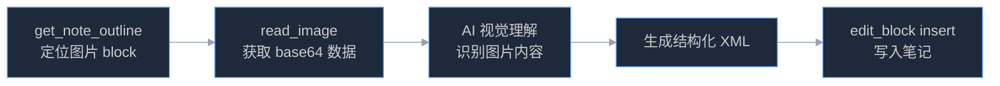

# 图片转文字笔记 — 识别笔记中的图片并生成文字内容

读取 WPS 笔记中的图片（白板照片、手写笔记、截图、流程图等），通过 AI 视觉理解识别图片内容，将识别结果作为结构化文字写回笔记。

## 何时使用

- 用户说"帮我识别这张图片"、"把图片内容转成文字"、"识别笔记里的图"
- 用户拍了白板照片，想把上面的内容变成文字笔记
- 用户有手写笔记的照片，想数字化
- 用户截了一张图，想提取里面的文字或结构
- 用户说"看看这张图写了什么"、"帮我把图上的东西整理出来"

**不适用于**：纯装饰性图片（风景照、头像等）、已有文字内容的笔记整理。

## 核心原理



## 依赖的 MCP 工具

| 工具 | 用途 |
|------|------|
| `get_current_note` | 获取当前笔记 ID |
| `get_note_outline` | 获取笔记大纲，定位 `type="image"` 的 block |
| `read_image` | 读取图片 block 的 base64 数据（AI 可直接视觉理解） |
| `edit_block` | 在图片下方插入识别结果（op: "insert"） |
| `batch_edit` | 批量插入多张图片的识别结果 |

## 工作流

### 第 1 步：定位图片

确定要识别哪些图片。

**场景 A — 当前笔记中的所有图片：**

```
get_current_note()
→ { note_id: "abc123" }

get_note_outline({ note_id: "abc123" })
→ blocks: [
    { id: "blk1", type: "paragraph", ... },
    { id: "blk2", type: "image", preview: "[图片]", ... },
    { id: "blk3", type: "paragraph", ... },
    { id: "blk4", type: "image", preview: "[图片]", ... },
  ]
```

从大纲中筛选 `type === "image"` 的 block，得到图片 block ID 列表。

**场景 B — 用户指定某张图片：**

用户可能说"第二张图片"或"那张白板照片"。先获取大纲，按顺序定位对应的图片 block。

**场景 C — 指定笔记中的图片：**

```
search_notes({ keyword: "会议记录" })
→ 找到目标笔记

get_note_outline({ note_id: "target_note_id" })
→ 筛选 type="image" 的 block
```

### 第 2 步：读取图片

对每个图片 block 调用 `read_image`：

```
read_image({ note_id: "abc123", block_id: "blk2" })
→ {
    success: true,
    _contentType: "image",
    image: {
      data: "iVBORw0KGgo...",   // base64
      mimeType: "image/png"
    },
    metadata: {
      block_id: "blk2",
      source_key: "sk-xxx",
      dimensions: { width: 1920, height: 1080 },
      alt: "白板照片"
    }
  }
```

> **关键**：`read_image` 返回的 base64 图片数据会被 MCP 层自动转为图片内容块，
> AI 模型可以直接"看到"这张图片并进行视觉理解。无需额外的 OCR 服务。

### 第 3 步：AI 视觉理解

拿到图片后，根据图片内容类型做不同处理：

| 图片类型 | 识别策略 | 输出格式 |
|----------|----------|----------|
| **手写笔记** | 逐行识别文字，保持原始段落结构 | `<p>` 段落 |
| **白板照片** | 识别文字 + 图形关系，提取关键信息 | `<h2>` + `<p>` + 列表 |
| **截图（文本）** | 精确提取文字内容 | `<p>` 或 `<codeblock>` |
| **截图（UI）** | 描述界面布局和元素 | `<p>` 描述 |
| **流程图/架构图** | 识别节点和连线关系 | 列表 或 表格 |
| **表格照片** | 识别表格结构和内容 | `<table>` |
| **混合内容** | 分区域识别，各区域对应处理 | 混合格式 |

### 第 4 步：生成结构化内容

将识别结果转为 WPS 笔记 XML 格式。

**基本模板：**

```xml
<highlightBlock emoji="📝" highlightBlockBackgroundColor="#DBEAFE">
  <p><strong>图片识别结果</strong></p>
</highlightBlock>
```

后跟具体识别内容，根据类型选择合适的 XML 结构。

**手写笔记示例：**

```xml
<highlightBlock emoji="📝" highlightBlockBackgroundColor="#DBEAFE">
  <p><strong>手写笔记识别</strong></p>
</highlightBlock>
<p>今天讨论了三个核心问题：</p>
<p listType="ordered" listLevel="0" listId="r1">用户留存率下降 3%，需要排查漏斗</p>
<p listType="ordered" listLevel="0" listId="r1">新功能上线时间推迟到下周三</p>
<p listType="ordered" listLevel="0" listId="r1">需要增加 2 名前端开发</p>
```

**白板照片示例：**

```xml
<highlightBlock emoji="📋" highlightBlockBackgroundColor="#FEF3CD">
  <p><strong>白板内容整理</strong></p>
</highlightBlock>
<h2>架构方案</h2>
<p>前端 → API Gateway → 微服务集群</p>
<p listType="bullet" listLevel="0">服务 A：用户认证</p>
<p listType="bullet" listLevel="1">JWT + Redis</p>
<p listType="bullet" listLevel="0">服务 B：订单处理</p>
<p listType="bullet" listLevel="1">消息队列异步</p>
```

**表格照片示例：**

```xml
<highlightBlock emoji="📊" highlightBlockBackgroundColor="#D1FAE5">
  <p><strong>表格识别</strong></p>
</highlightBlock>
<table>
  <tr><td><p><strong>姓名</strong></p></td><td><p><strong>部门</strong></p></td><td><p><strong>得分</strong></p></td></tr>
  <tr><td><p>张三</p></td><td><p>产品部</p></td><td><p>92</p></td></tr>
  <tr><td><p>李四</p></td><td><p>技术部</p></td><td><p>88</p></td></tr>
</table>
```

**代码截图示例：**

```xml
<highlightBlock emoji="💻" highlightBlockBackgroundColor="#EDE9FE">
  <p><strong>代码识别</strong></p>
</highlightBlock>
<codeblock lang="javascript">function fibonacci(n) {
  if (n &lt;= 1) return n;
  return fibonacci(n - 1) + fibonacci(n - 2);
}</codeblock>
```

### 第 5 步：写入笔记

将生成的内容插入到图片 block 的**下方**：

```
edit_block({
  note_id: "abc123",
  op: "insert",
  anchor_id: "blk2",         // 图片 block 的 ID
  position: "after",
  content: "<highlightBlock emoji=\"📝\" ...>...</highlightBlock><p>...</p>"
})
→ { success: true, new_block_ids: ["new1", "new2", ...] }
```

**多张图片时使用 `batch_edit`：**

```
get_note_outline({ note_id: "abc123" })
→ 刷新 block ID（前一次写入可能导致 ID 变化）

batch_edit({ note_id: "abc123", operations: [
  { op: "insert", anchor_id: "img_blk_1", position: "after", content: "..." },
  { op: "insert", anchor_id: "img_blk_2", position: "after", content: "..." },
]})
```

> **重要**：多张图片时，每次 `edit_block` 写入后 block ID 可能变化。
> 推荐两种策略：
> 1. 每次写入后重新 `get_note_outline` 刷新 ID
> 2. 一次性用 `batch_edit` 批量插入（batch_edit 内部按 insert 顺序处理，ID 不会互相影响）

### 第 6 步：告知用户

```
已识别 2 张图片并将结果写入笔记：
1. 白板照片 → 提取了架构方案（含 4 个服务节点）
2. 手写笔记 → 识别了 3 条会议要点

识别结果已插入到对应图片下方。
```

## 识别质量策略

| 场景 | 策略 |
|------|------|
| 图片模糊/低分辨率 | 尽力识别，在结果中标注"部分内容可能不准确" |
| 多语言混排 | 自动检测语言，保持原始语言 |
| 特殊符号/公式 | 使用 `<latex formula="..."/>` 标签 |
| 无法识别的区域 | 标注 `[无法识别]`，不强行编造 |
| 图片过小（宽或高 < 100px） | 提示用户"图片尺寸过小，识别可能不准确" |
| 装饰性图片（无文字信息） | 告知用户"这张图片没有可提取的文字内容"，不写入空内容 |

## 使用准则

- 始终使用中文回复（除非图片内容为英文或用户要求英文）
- 识别结果**插在图片下方**，绝不替换或删除原图
- 识别不确定的内容用 `[?]` 标注，不要编造
- 保留图片中的原始结构（编号、缩进、层级关系）
- 对于手写内容，保留书写者的用词，不要"润色"
- 写入前必须 `get_note_outline` 获取最新 block ID
- XML 中 `<` 和 `>` 必须转义为 `&lt;` 和 `&gt;`（代码块内容中）
- `<codeblock>` 内只放纯文本，不能嵌套其他 XML 标签

## 错误处理

| 场景 | 处理方式 |
|------|----------|
| 笔记中没有图片 | 提示"当前笔记没有图片，无需识别" |
| `read_image` 失败 | 提示"图片读取失败，可能正在上传中或已损坏"，跳过该图 |
| 图片数据为空 | 提示"图片数据为空"，跳过 |
| 笔记只读 | 正常识别，将结果以文本形式呈现给用户，不写入 |
| `edit_block` 写入失败 | 将识别结果以 markdown 形式呈现，供用户手动粘贴 |
| `BLOCK_NOT_FOUND` | 重新 `get_note_outline` 刷新后重试 |
| 图片数量 > 10 张 | 建议分批处理："笔记中有 N 张图片，建议先处理前 5 张" |

## 完整示例

### 示例：识别当前笔记中的白板照片

**用户说**："帮我把笔记里的图片识别成文字"

**步骤 1**：定位图片

```
get_current_note()
→ { note_id: "meeting_note_01" }

get_note_outline({ note_id: "meeting_note_01" })
→ blocks: [
    { id: "t1", type: "heading", preview: "周会纪要 2026-03-10" },
    { id: "p1", type: "paragraph", preview: "参会人员：张三、李四、王五" },
    { id: "img1", type: "image", preview: "[图片]" },
    { id: "p2", type: "paragraph", preview: "后续计划..." },
  ]
→ 找到 1 张图片：img1
```

**步骤 2**：读取图片

```
read_image({ note_id: "meeting_note_01", block_id: "img1" })
→ AI 看到一张白板照片，上面写着会议要点
```

**步骤 3**：识别并生成内容

AI 视觉分析后，生成 XML：

```xml
<highlightBlock emoji="📋" highlightBlockBackgroundColor="#FEF3CD">
  <p><strong>白板内容识别</strong></p>
</highlightBlock>
<h2>本周目标</h2>
<p listType="bullet" listLevel="0">完成 v2.1 版本发布</p>
<p listType="bullet" listLevel="0">修复 3 个 P0 级 bug</p>
<p listType="bullet" listLevel="0">新功能原型评审</p>
<h2>分工</h2>
<table>
  <tr><td><p><strong>负责人</strong></p></td><td><p><strong>任务</strong></p></td><td><p><strong>截止日</strong></p></td></tr>
  <tr><td><p>张三</p></td><td><p>发布流程</p></td><td><p>3/12</p></td></tr>
  <tr><td><p>李四</p></td><td><p>Bug 修复</p></td><td><p>3/13</p></td></tr>
  <tr><td><p>王五</p></td><td><p>原型设计</p></td><td><p>3/14</p></td></tr>
</table>
```

**步骤 4**：写入笔记

```
edit_block({
  note_id: "meeting_note_01",
  op: "insert",
  anchor_id: "img1",
  position: "after",
  content: "<highlightBlock emoji=\"📋\" ...>...</highlightBlock><h2>本周目标</h2>..."
})
→ { success: true }
```

**步骤 5**：告知用户

```
已识别白板照片并写入笔记：
- 提取了 2 个章节（本周目标、分工）
- 识别了 3 条目标和 3 人分工表

结果已插入到图片下方，请检查识别内容是否准确。
```
